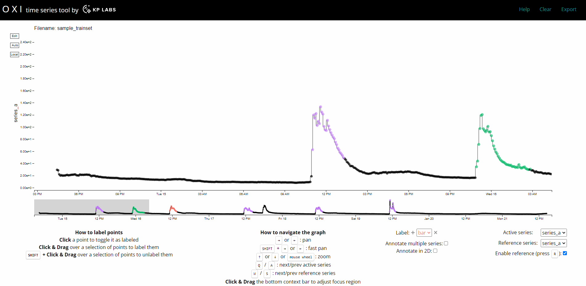

# OXI: An online tool for analysis and annotation of satellite telemetry data

OXI is a graphical tool for labeling time series data. Labeling is typically used to record interesting or anomalous points in time series data. For example, if you had temperature data from a sensor mounted in the satellite, you could label points that constitute unexpected temperature drops. You can upload multiple series and apply one or many labels. In the GIF below, `series_a` is being labeled with a `bar` label while `series_b` is serving as a reference.



This tool is based on the open-source [TRAINSET](https://github.com/Geocene/trainset) (commit [cb6fcb4](https://github.com/Geocene/trainset/commit/cb6fcb4aab3ead0c34ec650fa0a2af49f50ad256)) application by Geocene Inc. However, we significantly improved it in terms of performance and added a bunch of features for working with long multi-channel time series (such as satellite telemetry). All the changes relative to TRAINSET can be inspected in this [commit](https://github.com/kplabs-pl/OXI/commit/38ecc9490dd2d73930d6de4cbbeb798cfa26a9b9).


## Hosted Version

Our publicly hosted version is accessible under https://oxi.kplabs.pl/

## Build Setup

``` bash
# install dependencies
npm install

# serve with hot reload at localhost:8080
npm run dev

# build for production with minification
npm run build

# testing script for serving prod build locally
npm run start
```

## About us

This tool was designed by [KP Labs ](https://kplabs.space). KP Labs is a company that develops advanced solutions such as processing units (DPU, OBC with DPU), machine learning algorithms and software for edge processing on Smallsats. Its key domain is earth observation with a focus on hyperspectral data processing. The company was set up in 2016, with its headquarters in Poland. At the moment, the team of over 70 people develops products and projects for ESA, NASA and CSA. KP Labs also has its own product line called Smart Mission Ecosystem. For mission integrators and operators who need to build advanced spacecraft, the Smart Mission Ecosystem brings together the necessary hardware, software, and AI-powered algorithms for in-orbit data processing.
